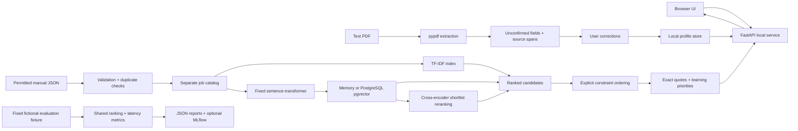

# Architecture and data boundaries

No supervised training is performed. The job corpus fits TF-IDF IDF, while profiles never fit the index. Embedding and cross-encoder revisions are fixed public pretrained models. The evaluation corpus is separate from imported runtime catalogs. Exact and heuristic near-duplicate checks do not substitute for split-level duplicate-family review in future supervised training.

Résumés and corrections stay local; models encode text locally. Public model downloads are the only ML network dependency. The default Docker image has no model dependencies and works in keyword mode. JSON reports contain fictional fixture data; private résumé files must not be published as reports or CI artifacts.

Profiles use local files; pgvector optionally stores versioned job embeddings. The catalog fingerprint binds results to the current corpus and model revision. Search uses exact cosine distance rather than an approximate index; no scalability claim is made. The single-user API serializes local writes and model access within one process. Multi-worker synchronization and transaction-based profile storage remain future production work.

## Public release boundary

The present deployment binds to loopback, including Docker Compose. A public résumé service needs authentication/authorization, resource-isolated PDF processing, encrypted/private storage, retention and backup deletion policies, request rate controls and end-to-end service benchmarks. None of these is replaced by random profile IDs, host checks or a successful local browser test. A fictional-only public demo can be considered separately after a hosting target is configured.
